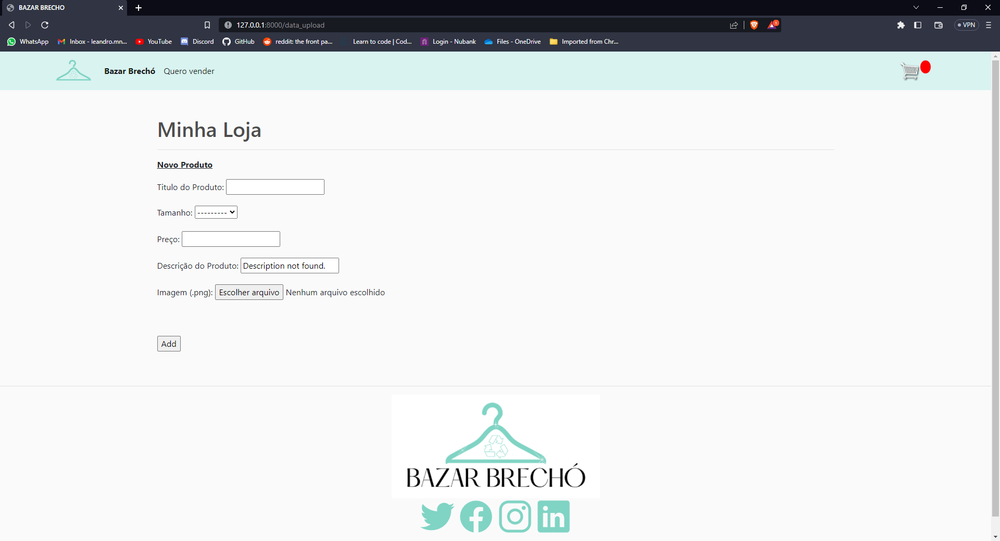

# Bazar-Brecho
A second hand clothing marketplace


# Development

## Create or Update you virtual environment
This projet encourage the use of a virtual environment to ensure that everthing
will work properly. You will find a `requiriment.txt` and also a `environment.yml` 
which can be used to create/update your enviroment.

### Using Conda
Type the following commands at your shell to create/update using conda.

Create: 
```
conda env create -f environment.yml
```

Update:
```
conda env update -f environment.yml
```

After that, you can activate your conda environment using `conda activate bazarbrecho`

### Using venv
Type the following commands at your shell to create/update using venv.

At directory where you want to have your environment.
Create:
Unix/MacOS: `python3 -m venv env` Win: `py -m venv env`

Activate env:
Unix/MacOS: `source env/bin/activate` Win: `.\env\Scripts\activate`

Update/Intalling packages:
Unix/MacOS: `python3 -m pip install -r requirements.txt` Win: `py -m pip install -r requirements.txt`

## Installing githock
This Project has some usefull pre-commit at `.pre-commit-config.yaml`. To have access to those hooks and use pre-commit in your local envirament you only need to go the source directory with your virtual environment active and run the following command: 
```
pre-commit install
```
After that, pre-commit will run the following usefull tools before each of your commits:

1. black (ensure a commum format)

# Back-End development
Django-based back-end development details

## Configuring and testing the webserver

Inside the virtualenv:
1. Go to `webserver/bazarbrecho`
2. Run `python manage.py makemigrations`
3. Run `python manage.py migrate`
4. Run `python manage.py runserver`
5. Open a browser and access the url `http://127.0.0.1:8000`

## Database

The database currently implemented is Django's built-in SQLITE3

To access it as an admin it is needed this simple setup:

- Run `python manage.py createsuperuser` and fill the form with new login information
- Run the server `python manage.py runserver`
- Access `http://127.0.0.1:8000/admin` or `http://localhost:8000/admin`
- Insert the credentials you just created

This page allows ani admin to access the information of every 
element on the table ProductEntry as well as edit it or create/delete entries

Images are located at 'templates/roupas'

## Test Database (Dump, Load and Test Data)

DUMP: To dump current database data run `python manage.py dumpdata > db.json`

LOAD: To load test data to the database run the command `python manage.py loadata db.json` if it exists

Note: To erase current data before loading run `python manage.py flush --database PRODUCTENTRY`
Be aware that this action wipes out all databases.

TEST: There is a sample of the Product database json information at homepage/tests/test_product_data.json

Note: Be aware that this is NOT the same as `db.json` to be used with `loadata`.
This should be used  as reference for the structure that should be returned at `http://127.0.0.1:8000/products/`

## Upload a new Product

To fill the database you can also access the New Product Registration page at
`http://127.0.0.1:8000/data_upload` or click 'Quero vender' at the navbar.

This page gives any user a form to fill information and upload it to the database.
Images are sent from the computer as a file. To test the form some sample images
can be found at `website_status/sample_images`

## Videos and tutorials:

The Net Ninja:
https://www.youtube.com/watch?v=n-FTlQ7Djqc&list=PL4cUxeGkcC9ib4HsrXEYpQnTOTZE1x0uc

Free Code Camp:
https://www.youtube.com/watch?v=F5mRW0jo-U4

Django best practices:
https://django-best-practices.readthedocs.io/en/latest/index.html

TO-DO item list (handling databases):
https://www.youtube.com/watch?v=ovql0Ui3n_I


## Current Status:

### Homepage


### Cart


### Checkout


### My Store
